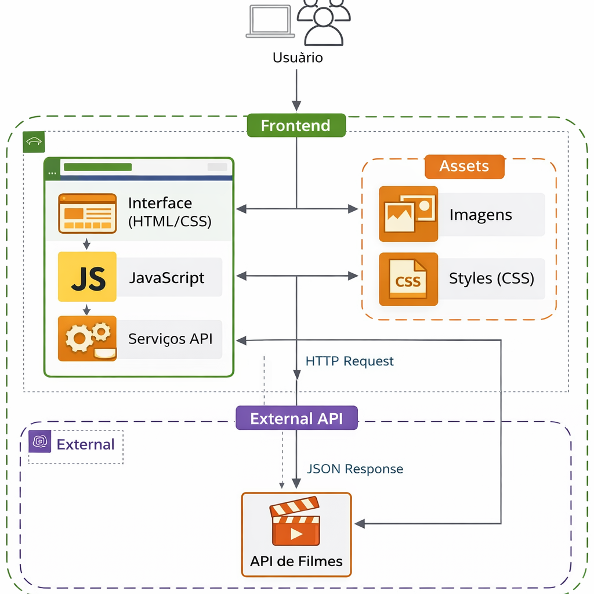
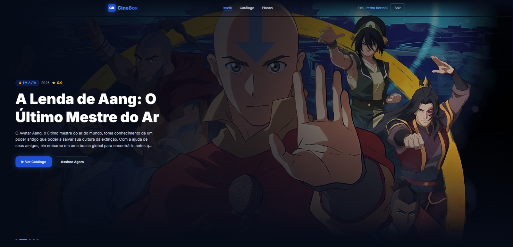
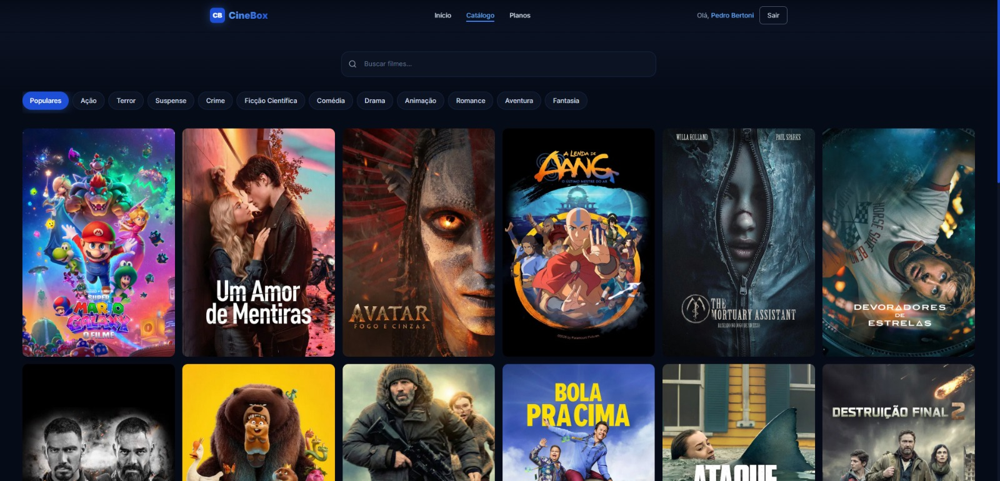
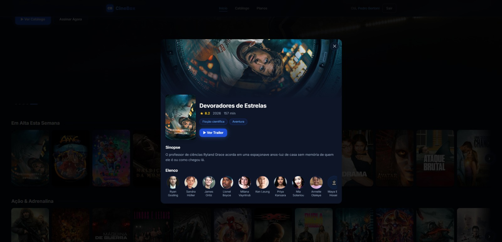
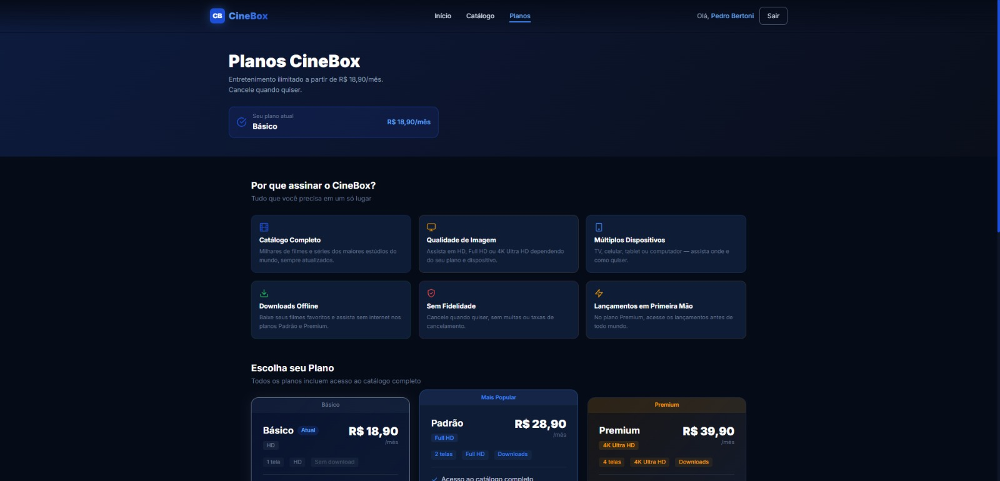
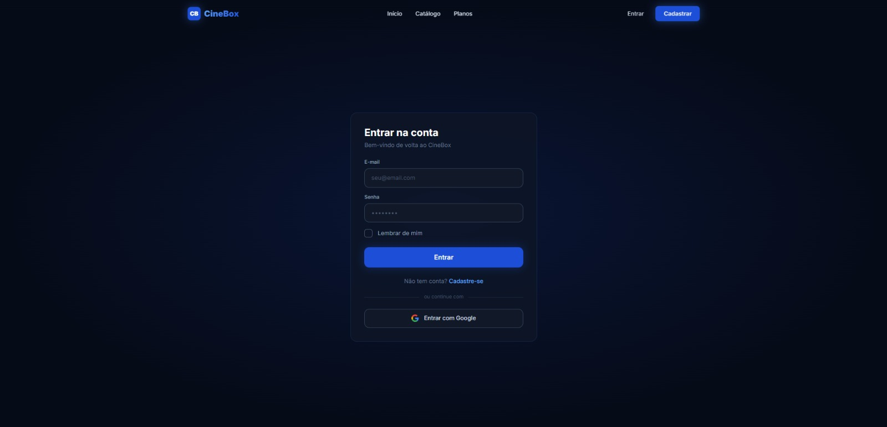
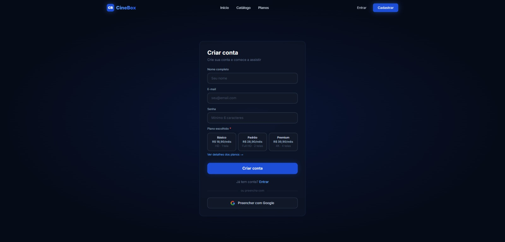

# 🎬 CineBox

> Trabalho acadêmico desenvolvido para a disciplina de **Desenvolvimento Web** do curso de **Análise e Desenvolvimento de Sistemas** da **Uni-FACEF — Centro Universitário Municipal de Franca**.

🔗 **Acesse o projeto:** [cinebox-stream.vercel.app](https://cinebox-stream.vercel.app/)

---

## 📋 Sobre o Projeto

O **CineBox** é uma plataforma de streaming de filmes inspirada em serviços como Netflix, desenvolvida como aplicação **Front-End** com integração ao **Firebase** para autenticação e persistência de dados. O projeto simula uma experiência completa de plataforma de entretenimento, com catálogo de filmes em tempo real, sistema de busca, filtros por gênero, modal de detalhes com elenco e trailer, planos de assinatura e autenticação real via Firebase — tudo sem back-end próprio.

O projeto faz parte de um ecossistema multiplataforma: existe também um **aplicativo mobile CineBox** desenvolvido em Flutter, que compartilha a mesma base de dados do Firebase e consome as mesmas APIs externas (TMDB e OMDb), garantindo uma experiência consistente entre web e mobile.

O objetivo acadêmico foi aplicar na prática os conceitos de desenvolvimento web moderno, incluindo componentização com React, consumo de APIs REST, gerenciamento de estado, roteamento client-side, autenticação real com Firebase Auth, persistência com Firestore e estilização responsiva com Tailwind CSS.

---

## ✨ Funcionalidades

### 🏠 Página Inicial (Home)
- Banner hero com rotação automática entre os filmes mais populares da semana, com transição suave e indicadores clicáveis
- Múltiplas seções de filmes organizadas por gênero: **Em Alta, Ação, Terror, Suspense, Policial, Ficção Científica, Animações e Comédia**
- Carrosséis horizontais com navegação por botões, sem interferir no scroll vertical da página
- Efeito de hover nos cards com escala, overlay e exibição de título e avaliação
- Clique em qualquer card abre o **modal de detalhes** do filme

### 🎬 Catálogo
- Exibição de filmes populares como padrão ao entrar na página
- **Filtros por gênero** em formato de pills clicáveis: Populares, Ação, Terror, Suspense, Crime, Ficção Científica, Comédia, Drama, Animação, Romance, Aventura e Fantasia
- **Busca em tempo real** com debounce de 400ms para evitar requisições desnecessárias
- **Paginação completa** com navegação por números, botões anterior/próxima e reticências para ranges grandes — tanto para filtros quanto para resultados de busca
- Clique em qualquer card abre o **modal de detalhes** do filme
- Todos os filmes exibidos possuem poster e backdrop garantidos (filtragem na camada de API)

### 🎞️ Modal de Detalhes do Filme
- Abre ao clicar em qualquer card de filme, tanto na Home quanto no Catálogo
- **Backdrop** em tela cheia com gradiente suave para o fundo do modal
- **Poster**, título, nota (⭐), ano de lançamento e duração em minutos
- **Pills de gênero** com estilo consistente ao design system
- **Botão "Ver Trailer"** que abre o trailer oficial no YouTube em nova aba (quando disponível)
- **Sinopse** completa em português (pt-BR)
- **Carrossel de elenco** com foto circular, nome e personagem dos 10 primeiros atores
- Fecha ao clicar fora do modal, no botão ✕ ou pressionando **ESC**
- Dados carregados via `append_to_response=credits,videos` em uma única requisição à TMDB

### 💳 Planos de Assinatura
- Três planos: **Básico (R$ 19,90)**, **Intermediário (R$ 29,90)** e **Avançado (R$ 49,90)**
- Cards interativos com borda e glow colorido ao hover, efeito shimmer no botão
- Badges de destaque: "Mais Popular" (azul) e "Premium" (âmbar), ambos com fundo sólido e glow
- Ícones SVG únicos por plano que reagem ao hover
- Seção **"Por que confiar no CineBox"** com 4 cards detalhados: Pagamento Seguro, Cancelamento, Sem Fidelidade e Suporte em Português
- Ao clicar em "Começar agora", redireciona automaticamente para a página de cadastro

### 🔐 Autenticação com Firebase
- **Cadastro** com campos de nome, e-mail, senha e seleção de plano via cards clicáveis
- **Login com e-mail e senha** com validação real contra o Firebase Authentication
- **Login com Google** via popup (OAuth 2.0), disponível tanto no login quanto no cadastro
- Opção **"Lembrar de mim"** que alterna entre `browserSessionPersistence` e `browserLocalPersistence`
- Dados do usuário (nome, e-mail, plano, data de cadastro) persistidos no **Firestore**
- Após login, a navbar exibe "Olá, [Nome do usuário]" com botão de sair
- Sessão gerenciada pelo `onAuthStateChanged` do Firebase — persiste entre recarregamentos quando "Lembrar de mim" está ativo
- Mensagens de erro traduzidas para português (e-mail já cadastrado, senha incorreta, etc.)

---

## 📱 Integração com o App Mobile

O CineBox Web faz parte de um ecossistema multiplataforma junto ao **CineBox Mobile**, desenvolvido em **Flutter**.

| Aspecto | Web (React) | Mobile (Flutter) |
|---|---|---|
| Autenticação | Firebase Auth | Firebase Auth |
| Banco de dados | Firestore | Firestore |
| Dados de filmes | TMDB API v3 | TMDB API v3 |
| Dados complementares | OMDb API | OMDb API |
| Persistência de sessão | Firebase Auth SDK | Firebase Auth SDK |

- Um usuário cadastrado no app mobile pode fazer login na versão web com as mesmas credenciais, e vice-versa
- O plano de assinatura escolhido é salvo no Firestore e acessível em ambas as plataformas
- Ambas as plataformas consomem os mesmos endpoints da TMDB e OMDb com os mesmos parâmetros (`language=pt-BR`, `vote_count.gte=200`)

---

## 🛠️ Tecnologias Utilizadas

| Tecnologia | Versão | Finalidade |
|---|---|---|
| [React](https://react.dev/) | 18.3 | Biblioteca principal de UI com componentes funcionais e hooks |
| [Vite](https://vitejs.dev/) | 5.2 | Bundler e servidor de desenvolvimento |
| [Tailwind CSS](https://tailwindcss.com/) | 4.0 | Estilização utilitária com tema customizado via `@theme` |
| [React Router DOM](https://reactrouter.com/) | 6.23 | Roteamento client-side com BrowserRouter |
| [Firebase](https://firebase.google.com/) | 12.12 | Autenticação (Auth) e banco de dados (Firestore) |
| [TMDB API](https://www.themoviedb.org/documentation/api) | v3 | Fonte principal de dados de filmes em tempo real |
| [OMDb API](https://www.omdbapi.com/) | — | Dados complementares de filmes |

---

## 🌐 APIs Externas

### TMDB — The Movie Database

Principal fonte de dados do projeto. API pública com um dos maiores bancos de dados de filmes do mundo.

| Endpoint | Descrição |
|---|---|
| `GET /trending/movie/week` | Filmes em alta na semana (Hero Banner e seção Em Alta) |
| `GET /discover/movie` | Filmes filtrados por gênero com ordenação por popularidade |
| `GET /movie/popular` | Filmes populares gerais (padrão do catálogo) |
| `GET /search/movie` | Busca de filmes por título |
| `GET /movie/{id}?append_to_response=credits,videos` | Detalhes completos, elenco e trailers do filme |

**Parâmetros aplicados em todas as requisições:**
- `language=pt-BR` — títulos e sinopses em português brasileiro
- `vote_count.gte=200` — garante que apenas filmes conhecidos apareçam
- Filtragem client-side: filmes sem `poster_path` ou `backdrop_path` são descartados automaticamente

### OMDb — Open Movie Database

Utilizada como fonte complementar de dados e metadados adicionais de filmes.

| Endpoint | Descrição |
|---|---|
| `GET /?s={query}` | Busca de filmes por título |
| `GET /?i={imdbID}` | Detalhes completos por ID do IMDb |

---

## 🔥 Firebase

O projeto utiliza dois serviços do Firebase:

### Firebase Authentication
- Cadastro e login com **e-mail e senha**
- Login com **Google** (OAuth 2.0 via popup)
- Persistência de sessão configurável (`session` ou `local`)
- Gerenciamento de estado via `onAuthStateChanged`

### Cloud Firestore
- Coleção `users` com documentos por `uid`
- Campos armazenados: `name`, `email`, `plan`, `createdAt`
- Operações com `setDoc` (merge) para criação e atualização de perfil
- Leitura do plano do usuário no login para sincronização entre plataformas

### Variáveis de Ambiente

As credenciais do Firebase são carregadas via variáveis de ambiente (`.env`):

```
VITE_FIREBASE_API_KEY=
VITE_FIREBASE_AUTH_DOMAIN=
VITE_FIREBASE_PROJECT_ID=
VITE_FIREBASE_STORAGE_BUCKET=
VITE_FIREBASE_MESSAGING_SENDER_ID=
VITE_FIREBASE_APP_ID=
VITE_FIREBASE_MEASUREMENT_ID=
VITE_OMDB_API_KEY=
```

---

## 🗂️ Estrutura do Projeto

```
projeto_cinebox/
├── public/
│   └── assets/
│       └── CineBoxWeb.png       # Diagrama de arquitetura da aplicação
├── src/
│   ├── api/
│   │   ├── tmdb.js              # Integração com a TMDB API
│   │   └── omdb.js              # Integração com a OMDb API
│   ├── components/
│   │   ├── Footer.jsx           # Rodapé com links, categorias e créditos
│   │   ├── HeroBanner.jsx       # Banner principal com rotação automática
│   │   ├── MovieCard.jsx        # Card individual de filme com hover e onClick
│   │   ├── MovieModal.jsx       # Modal de detalhes: elenco, sinopse e trailer
│   │   ├── MovieRow.jsx         # Carrossel horizontal de filmes por seção
│   │   ├── Navbar.jsx           # Barra de navegação fixa com glassmorphism
│   │   └── SearchBar.jsx        # Campo de busca com debounce
│   ├── context/
│   │   └── AuthContext.jsx      # Contexto global de autenticação via Firebase
│   ├── pages/
│   │   ├── Catalog.jsx          # Página de catálogo com filtros e paginação
│   │   ├── Home.jsx             # Página inicial com seções por gênero
│   │   ├── Login.jsx            # Tela de login (e-mail/senha e Google)
│   │   ├── Plans.jsx            # Página de planos de assinatura
│   │   └── Register.jsx         # Tela de cadastro com seletor de plano
│   ├── App.jsx                  # Roteamento principal e providers
│   ├── firebase.js              # Inicialização do Firebase (Auth + Firestore)
│   ├── index.css                # Estilos globais, tema Tailwind e autofill fix
│   └── main.jsx                 # Ponto de entrada da aplicação
├── .env                         # Variáveis de ambiente (não versionado)
├── index.html
├── package.json
└── vite.config.js
```

---

## 🏗️ Arquitetura da Aplicação

O diagrama abaixo ilustra a arquitetura geral do CineBox, mostrando o fluxo de dados entre os componentes, páginas, contexto de autenticação, Firebase e as APIs externas.



---

## 📸 Screenshots

### 🏠 Página Inicial


### 🎬 Catálogo


### 🎞️ Detalhes do Filme


### 💳 Planos de Assinatura


### 🔐 Login


### 📝 Cadastro


---

## 🎨 Design System

### Paleta de Cores

| Papel | Cor | Hex |
|---|---|---|
| Primária | Azul principal | `#1D4ED8` |
| Primária hover | Azul escuro | `#1E40AF` |
| Destaque / Glow | Azul claro | `#60A5FA` |
| Fundo principal | Azul quase preto | `#060B18` |
| Fundo secundário | Azul escuro | `#0D1526` |
| Cards / Painéis | Azul médio escuro | `#0F1C35` |
| Inputs | Cinza azulado | `#111827` |
| Premium / Âmbar | Laranja escuro | `#B45309` |
| Texto principal | Branco suave | `#E2E8F0` |

### Componentes Visuais
- **Glassmorphism** — navbar ao rolar, cards de aviso e botões secundários com `backdrop-filter: blur`
- **Gradiente de texto** — logotipo e títulos de destaque com `background-clip: text`
- **Glow effects** — `box-shadow` colorido em botões, cards ativos e logo
- **Carrossel por transform** — scroll horizontal via `translateX` sem `overflow-x: auto`, evitando captura do scroll vertical da página
- **Modal overlay** — fundo escuro semitransparente com fechamento por clique externo ou ESC
- **Autofill fix** — `-webkit-box-shadow` inset para manter o background escuro nos inputs preenchidos automaticamente pelo browser

### Tipografia
- **Inter** (Google Fonts) — pesos 300 a 900

---

## 🚀 Como Executar

### Pré-requisitos
- [Node.js](https://nodejs.org/) versão 18 ou superior
- npm (incluso com o Node.js)
- Projeto configurado no [Firebase Console](https://console.firebase.google.com/) com Authentication e Firestore habilitados

### Instalação e execução

```bash
# Clone o repositório
git clone https://github.com/seu-usuario/projeto_cinebox.git

# Acesse a pasta do projeto
cd projeto_cinebox

# Instale as dependências
npm install

# Configure as variáveis de ambiente
# Crie um arquivo .env na raiz com as credenciais do Firebase e OMDb

# Inicie o servidor de desenvolvimento
npm run dev
```

Acesse **http://localhost:5173** no navegador.

### Scripts disponíveis

```bash
npm run dev      # Inicia o servidor de desenvolvimento com hot reload
npm run build    # Gera o build de produção na pasta /dist
npm run preview  # Visualiza o build de produção localmente
```

---

## 📄 Observações Acadêmicas

- A autenticação utiliza o **Firebase Authentication**, um serviço real de autenticação. Os dados cadastrados persistem entre sessões conforme a opção "Lembrar de mim".
- Os dados dos usuários (nome, e-mail, plano) são armazenados no **Cloud Firestore**, compartilhado com o app mobile CineBox.
- As chaves de API da TMDB e OMDb utilizadas são de uso público para fins acadêmicos e de demonstração.
- As credenciais do Firebase são carregadas via variáveis de ambiente e **não são versionadas** no repositório.
- O projeto é **100% Front-End**, sem back-end próprio — toda a lógica de servidor é delegada ao Firebase.

---

## 👨🎓 Informações Acadêmicas

| | |
|---|---|
| **Instituição** | Uni-FACEF — Centro Universitário Municipal de Franca |
| **Curso** | Análise e Desenvolvimento de Sistemas |
| **Disciplina** | Desenvolvimento Web |
| **Ano** | 2026 |

---

<p align="center">
  Desenvolvido com dedicação para a <strong>Uni-FACEF</strong> · Franca, SP
</p>
